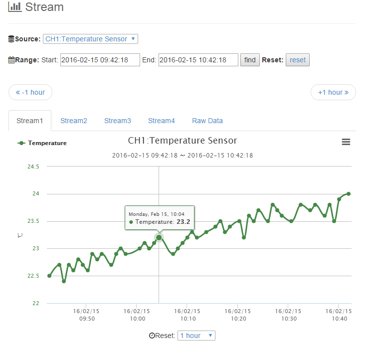

Analog Sensing for ESPr One(ESP-WROOM-02)
====

「Analog Sensing for ESPr One(ESP-WROOM-02)」は、[ESPr One(ESP-WROOM-02 Arduino互換ボード)](https://www.switch-science.com/catalog/2620/)を使って、
アナログセンシング値をIoTクラウド：[Scalenics](http://scalenics.io/)へグラフ表示することができます。

## Description
本スケッチは、ESPr OneのA0に入力されたアナログ値を1秒間隔でセンシングし、
IoTクラウド：[Scalenics](http://scalenics.io/)へその値をアップロードします。

＜注:ESPr Oneのスペック＞
* アナログ入力 : A0の1つのみです。入力範囲は0～3.3 V（基板上で0～1.0 Vに変換しています）
* 10 bitA/Dコンバータを搭載しています

## Demo

センシングした値を、[Scalenics](http://scalenics.io/)へグラフ表示します（以下のグラフは、温度に変換した例です）

 

## Requirement

* [ESPr One(ESP-WROOM-02 Arduino互換ボード)](https://www.switch-science.com/catalog/2620/)を用意してください
* [Arduino LLC (Arduino.cc)](https://www.arduino.cc/) Arduino IDE 1.6.4以降のバージョンを使用してください 
  ※[Arduino SRL (Arduino.org)](http://www.arduino.org/)系のArduino IDE 1.7.Xでは、ESP8266ボードを追加できません
* [Scalenics](http://scalenics.io/)のアカウントが必要です

## Usage

1. 「analogsensing-wifi-scalenics.ino」を実行します
2. スケッチ内の以下の項目を変更します 
　
   * ① 接続するルーターのIPアドレスが固定の場合は、そのIPアドレス, デフォルトゲートウェイ, サブネットマスクに書き換えます（通常、変更する必要はありません）
   * ② 接続する無線ルーターのSSIDに書き換えます
   * ③ 接続する無線ルーターの暗号化キー（パスワード）に書き換えます
   * ④ ScalenicsのUsername(ID)に書き換えます
   * ⑤ ScalenicsのManagement Console -> Admin Profile内にある「Device Token」に書き換えます
   * ⑥ 任意のセンサーIDに書き換えます

## Install

1. [このサイト](http://trac.switch-science.com/wiki/esp_dev_arduino_ide)を参考に、Arduino IDEへESP8266ボードを追加します 
   ※Arduino IDE 1.6.9の設定例は、以下の通りです 
   
2. [Arduino Client for MQTT](https://github.com/knolleary/pubsubclient)をインストールします 
   ※インストール手順は、「[EnOcean Library for Arduino](https://github.com/simics-co/EnOcean)」のREADME.md：Install 1～4を参考にしてください 
3. [GitHub repository](https://github.com/simics-co/analogsensing-wifi-scalenics)から[analogsensing-wifi-scalenics-master.zip](https://github.com/simics-co/analogsensing-wifi-scalenics/archive/master.zip)をダウンロードします
4. 圧縮ファイルを展開し、フォルダ名を「analogsensing-wifi-scalenics.ino」へ変更します

## Contribution

1. Forkする ( https://github.com/simics-co/EnOcean#fork-destination-box )
2. ローカル上でbranchを作る (git checkout -b my-new-feature)
3. 変更した内容をcommitする (git commit -am 'Add some feature')
4. pushする (git push origin my-new-feature)
5. Pull Requestを作成する

## Licence

   Copyright 2016 LoonaiFactory

   Licensed under the Apache License, Version 2.0 (the "License");
   you may not use this file except in compliance with the License.
   You may obtain a copy of the License at

       http://www.apache.org/licenses/LICENSE-2.0

   Unless required by applicable law or agreed to in writing, software
   distributed under the License is distributed on an "AS IS" BASIS,
   WITHOUT WARRANTIES OR CONDITIONS OF ANY KIND, either express or implied.
   See the License for the specific language governing permissions and
   limitations under the License.

## Author

[LoonaiFactory](https://github.com/loonaifactory)
